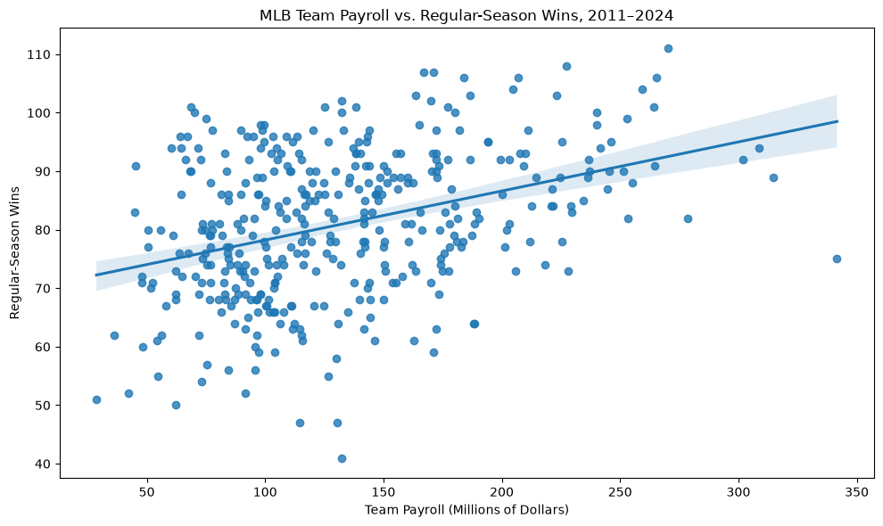
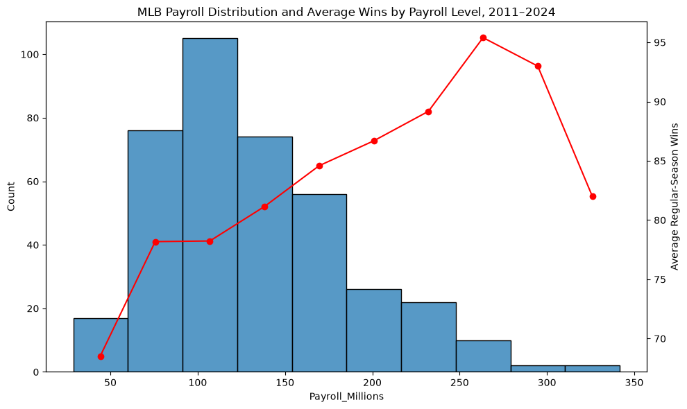

# MLB Team Payroll and Regular-Season Wins
## Research Question

How strongly is MLB team payroll associated with regular-season wins from 2011 to 2024?

## Background and Context
Some Major League Baseball teams can spend much more money than others. For example, the New York Mets and Los Angeles Dodgers have been spending more money in recent years than anyone else, while teams like the Cleveland Guardians and Miami Marlins do not spend very much. So the Mets and Dodgers can sign many of the good players, as they can give them deeper contracts, and steal any good players from the Guardians and Marlins, since they can give those players better contracts than the Guardians or Marlins. But does this contribute directly to wins? This project will examine the relationship between payroll from season to season and the number of regular season wins, for each team.

## Dataset
The dataset used for this project includes team payroll and regular season win totals for each season from 2011 to 2024, with the exception of 2020, due to the season being shortened to 60 games rather than 162 due to COVID-19. Because of this exception, we have a dataset of 13 seasons, and 390 total teams, since there is 30 teams in Major League Baseball.

The dataset was obtained from the Kaggle dataset MLB Team Payrolls 2011–2024. The original dataset contains information about team payroll, wins, losses, average age, roster status, and postseason results.

## Variables
The variables used in this project were:
- team
- season
- payroll (in millions of dollars)
- wins

Losses are technically part of this project, since every season included in this dataset was 162 games, so a team's number of losses is (total games - wins).

Payroll: The amount of money allocated by an MLB team toward its players during a season. This is the "Total Payroll Allocations" variable from the dataset, converted from dollar-formatted text into a numerical value measured in U.S. dollars. Payroll is the independent variable in this analysis.

Wins: The number of games an MLB team wins during the regular season. Playoffs are not included due to uneven number of games, as some teams play 0, while some may play as many as 22. It is the "Wins" variable in the dataset, representing the number of regular-season games won by each team. Wins are the dependent variable in this analysis.

